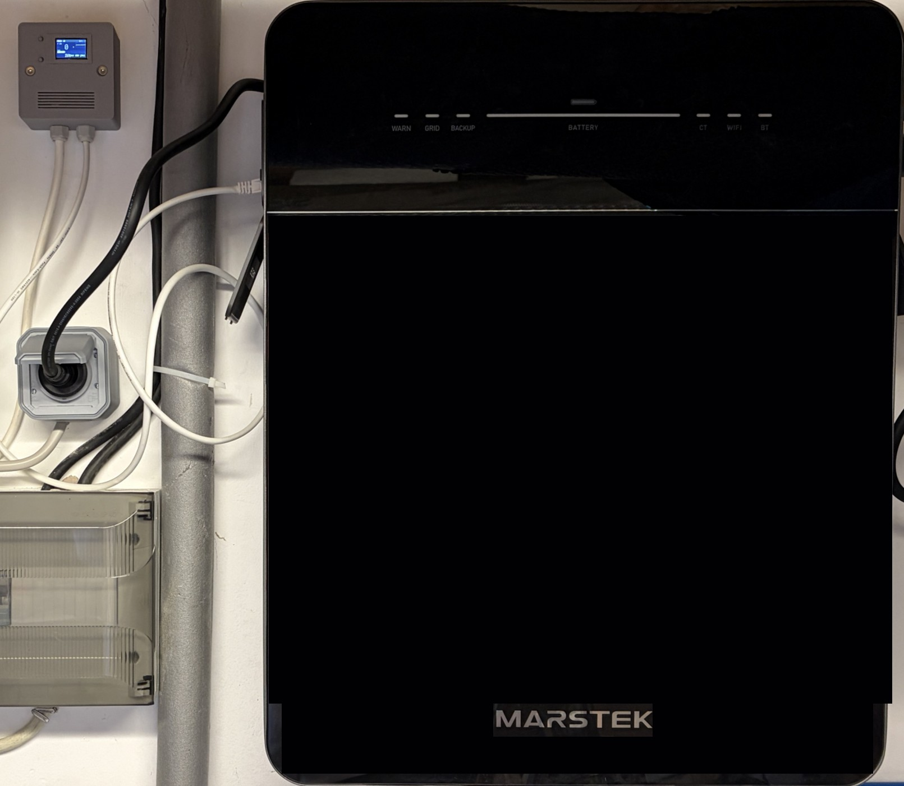
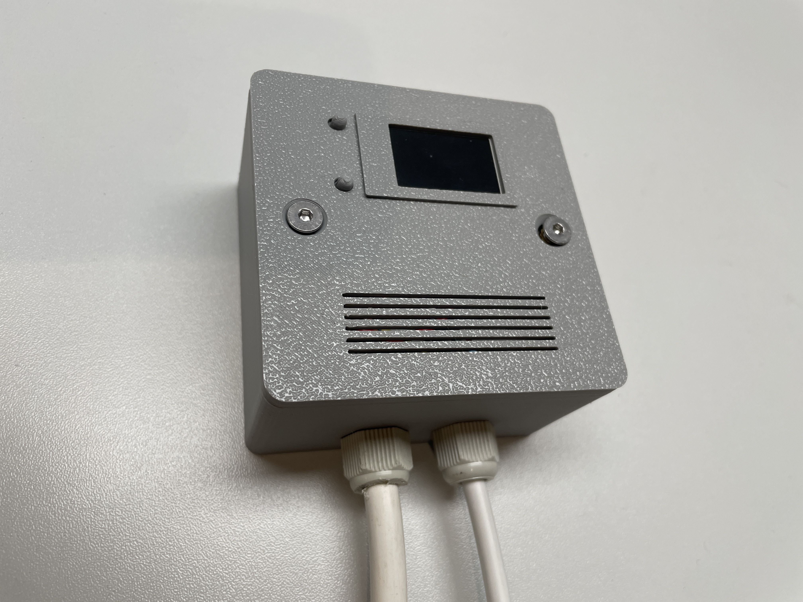
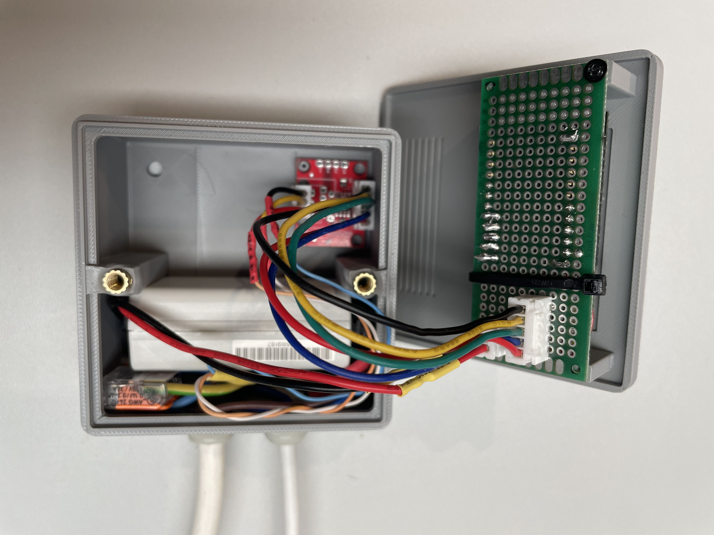
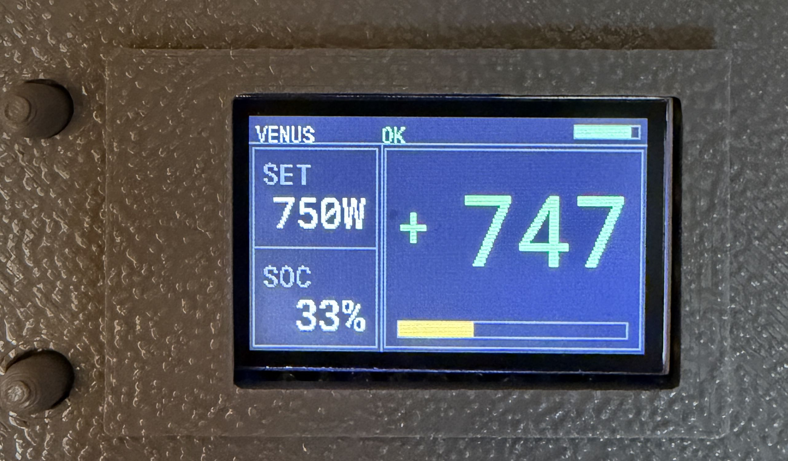

# Marstek Venus ESPHome HA RS485

Local control and monitoring of a **Marstek Venus** battery using a **LILYGO/TTGO T-Display**, **ESPHome**, **RS485/Modbus RTU** and **Home Assistant**.

[🇩🇪 Deutsche README](README_DE.md)

The ESP32 communicates directly with the Venus over RS485. No cloud connection is required for the local control path. The TTGO display shows the most important information at the battery while Home Assistant exposes sensors, diagnostics and charge/discharge setpoints.

> **Status:** working project / reference implementation. Tested with a Marstek Venus E Gen3 and firmware V148. Marstek firmware changes can affect Modbus behaviour, so verify control after battery firmware updates.

## Finished installation

<p align="center"></p>

The compact TTGO controller is mounted next to the Marstek Venus and handles the local RS485 communication.

<p align="center"></p>

## Why this project?

The main purpose of this project is not simply to display Marstek data in Home Assistant. It is to make the **Marstek Venus a controllable part of a higher-level home energy-management system**.

In the original installation, PV surplus is distributed according to a custom priority scheme:

1. **EV first:** as much available PV surplus as possible should go to the electric vehicle.
2. **Hot water second:** if the EV is not charging or is full, a Node-RED flow controls an immersion heater in several stages between **0 and 3000 W**.
3. **Marstek last:** only when neither EV nor hot water needs the surplus is the Marstek charged.

The battery is therefore mainly used to shift otherwise unused PV energy to later house consumption, especially at night. In the other direction, it must **not discharge in order to feed the EV or immersion heater**. For this reason the built-in Marstek control logic alone was not sufficient; charge and discharge power had to become explicitly controllable by a higher-level automation.

This repository provides that general-purpose **ESPHome / RS485 / Home Assistant interface**. The actual Node-RED energy-management flow is deliberately **not part of the repository**, because it depends strongly on the individual PV system, wallbox, EV, hot-water system and desired priorities.

## Hardware / parts list

| Part | Purpose | Notes | Link |
|---|---|---|---|
| LILYGO / TTGO T-Display ESP32 | Controller, Wi-Fi and local display | ST7789, 135 × 240 px | [Amazon*](https://link.amazon/B0gITBNf5) |
| TTL ↔ RS485 transceiver module | Modbus/RS485 interface | module used here exposes `3-5V`, `RX-I`, `TX-O`, `RTS`, `GND` and `A/B/G` | [Amazon*](https://link.amazon/B0evMwitV) |
| 5 V power supply | Permanent controller supply | +5 V and GND feed the green carrier/perfboard; Micro-USB is not the normal installed supply | [Amazon*](https://link.amazon/B0cxu0tlI) |
| Standard Ethernet patch cable | Connection to Marstek | one end is cut off; reference build uses T568B | any suitable cable |
| 3D-printed enclosure | Mechanical protection | Body + Cover STL included | [STL folder](enclosure/STL/) |

\* **Affiliate notice:** Links marked with `*` may be affiliate links. If you buy through them, the project owner may receive a small commission. Your price does not change.

## Wiring

### Complete overview

The Marstek does **not power the controller** in this build. Both TTGO and RS485 transceiver are powered from the **external 5 V supply**. The Marstek side carries only the three RS485 conductors **A, B and G**.

```text
230 V AC
   │
   ▼
5 V power supply
   │  +5 V / GND
   ▼
green carrier / perfboard
   ├──────────────► TTGO T-Display
   └──────────────► RS485 module: 3-5V + GND

TTGO T-Display                  RS485 module
GPIO27 (TX) ──────────────────► RX-I
GPIO26 (RX) ◄────────────────── TX-O
GPIO25      ──────────────────► RTS
GND         ─────────────────── GND

RS485 module                    T568B patch cable      Marstek RJ45
A ────────────────────────────► white/orange ────────► pin 1
B ────────────────────────────► orange ─────────────► pin 2
G ────────────────────────────► blue ───────────────► pin 4
```

### Complete connection table

| From | To | Function |
|---|---|---|
| external supply +5 V | green carrier board | power |
| external supply GND | green carrier board | ground |
| carrier board +5 V | TTGO 5 V input | TTGO power |
| carrier board GND | TTGO GND | TTGO ground |
| carrier board +5 V | RS485 `3-5V` | transceiver power |
| carrier board GND | RS485 `GND` | transceiver ground |
| TTGO GPIO27 (TX) | RS485 `RX-I` | UART TTGO → transceiver |
| TTGO GPIO26 (RX) | RS485 `TX-O` | UART transceiver → TTGO |
| TTGO GPIO25 | RS485 `RTS` | transmit/receive direction |
| RS485 `A` | T568B white/orange | Marstek RS485 A, RJ45 pin 1 |
| RS485 `B` | T568B orange | Marstek RS485 B, RJ45 pin 2 |
| RS485 `G` | T568B blue | RS485 reference, RJ45 pin 4 |

### Power supply

In the permanently installed reference build the TTGO is **not powered through Micro-USB**. The external supply feeds 5 V to the green carrier/perfboard. From there, both the TTGO and RS485 module are powered.

A USB cable visible in some photos was used only for **testing/flashing**.

> **Important:** Verify voltage and polarity before connecting. Do not connect an external 5 V feed and USB at the same time unless you have verified that your specific hardware safely supports it.

### ESPHome pins

The TTGO-side pins are also fixed by the current YAML:

```yaml
uart:
  id: uart_rs485
  tx_pin: GPIO27
  rx_pin: GPIO26
  baud_rate: 115200
  data_bits: 8
  parity: NONE
  stop_bits: 1

modbus:
  id: modbus1
  uart_id: uart_rs485
  flow_control_pin: GPIO25
```

Reference parameters:

```text
Baud rate: 115200
Data bits: 8
Parity: NONE
Stop bits: 1
Modbus slave ID: 1
```

### Patch cable / RJ45

The reference build uses a normal **T568B Ethernet patch cable** cut at one end. The RJ45 plug remains connected to the Marstek; only three conductors are used at the open end:

| RJ45 pin | T568B colour | RS485 module |
|---:|---|---|
| 1 | white/orange | A |
| 2 | orange | B |
| 4 | blue | G |

At the small 3-pin connector inside the controller, **in the orientation shown in the project photos**, the wires are top-to-bottom **blue → white/orange → orange**.

> **Important:** Do not blindly copy wire colours. With a different or differently wired patch cable, identify RJ45 pins 1, 2 and 4 using a continuity tester.

> **Photo orientation warning:** Some RS485-board reference images show the **underside** or are rotated. Do not copy physical left/right/top/bottom positions from a photo. Follow the printed labels `A`, `B`, `G`, `3-5V`, `GND`, `RX-I`, `TX-O` and `RTS`.

### Inside the controller

<p align="center"></p>

The TTGO, green carrier board and RS485 interface are housed together.

## Display and the two buttons

<p align="center"></p>

The display shows the setpoint (**SET**), state of charge (**SOC**), current power and communication/Wi-Fi status.

> **Experimental / not yet hardware-tested:** The button behaviour is implemented in the YAML but has not yet been verified on the physical unit shown here.

- **Left button (GPIO0):** +100 W per press; positive values mean charging.
- **Right button (GPIO35):** −100 W per press; negative values mean discharging.
- At **0 W** output is stopped.
- Range: **−2500 W to +2500 W**.
- Only active while **Venus Master (RS485 Enable)** is enabled.

## ESPHome installation

1. Copy [`esphome/marstek-venus-ttgo.yaml`](esphome/marstek-venus-ttgo.yaml) into ESPHome.
2. Create `secrets.yaml` using [`esphome/secrets.example.yaml`](esphome/secrets.example.yaml).
3. Check pins and wiring.
4. Validate the YAML and flash the TTGO.
5. Add the device to Home Assistant.
6. Verify **Venus Modbus OK** before enabling automations.

## Home Assistant

<p align="center"></p>

Entities include SoC, AC power, stable/filtered power, temperatures, maximum charge/discharge power, Modbus status, charge/discharge setpoints, RS485 Master, emergency stop, OTA Quiet Mode, restart and WiFi RSSI.

## Why is there an OTA Quiet Mode?

With weak Wi-Fi reception, the ESP32 should retain as much headroom as possible for radio and communication tasks. Display rendering creates CPU/SPI load, while the backlight consumes additional electrical power. In the current configuration Quiet Mode switches off the backlight, reducing electrical load; display rendering currently continues in the background. Marstek control remains active.

## Control registers

| Register | Purpose | Values used |
|---:|---|---|
| `42000` | RS485 control enable | `21930` = enable, `21947` = disable |
| `42010` | Force mode | `0` standby, `1` charge, `2` discharge |
| `42020` | Forced charge power | 0…2500 W |
| `42021` | Forced discharge power | 0…2500 W |
| `42011` | Charge-to-SoC | % |
| `44002` | Max charge power | readback |
| `44003` | Max discharge power | readback |

### Firmware note

Marstek firmware can disable remote/RS485 control again. The RS485 control code is therefore included in the heartbeat:

```text
Heartbeat: ... req=-700 meas=797 rs485=21930 ctrl=2 dis_reg=700 ...
```

If setpoint and force mode look correct but the battery remains at 0 W, check `42000` / `rs485` first.

## What the firmware does

The YAML includes fast/slow Modbus polling, multi-stage plausibility and anti-glitch filtering, median filtering, SoC jump rejection, request/ack tracking, under-delivery diagnostics, Modbus freshness monitoring, recovery/watchdog logic, emergency stop, TFT UI and RS485 control-code readback in the heartbeat.

A detailed explanation is in [`docs/CODE_EXPLAINED.md`](docs/CODE_EXPLAINED.md).

## 3D-printed enclosure

- [`Body.stl`](enclosure/STL/Body.stl) – enclosure body
- [`Cover.stl`](enclosure/STL/Cover.stl) – front cover with display, button and ventilation openings

## Credits / prior work

This project builds on work from the Marstek community. **ViperRNMC – marstek_venus_modbus** was an important reference for Marstek Venus Modbus registers, while **Superduper1969 – MarstekVenus-LilygoRS485** provided an ESPHome/LILYGO RS485 reference and inspiration.

## Support this project

<a href="https://paypal.me/toor0001"></a>

## Development note

This project was developed in a collaborative **vibe-coding workflow** using **ChatGPT** and **OpenAI Codex** for code generation, review, debugging and documentation.

The hardware design, integration decisions, practical testing and final responsibility for the project remain with the project author.

## Safety

This software can command battery charge and discharge power. Use it only if you understand your installation and battery limits. Keep the manufacturer's protection systems enabled and test changes at low power first.

This is an independent community project and is **not affiliated with or endorsed by Marstek, LILYGO, ESPHome or Home Assistant**.
